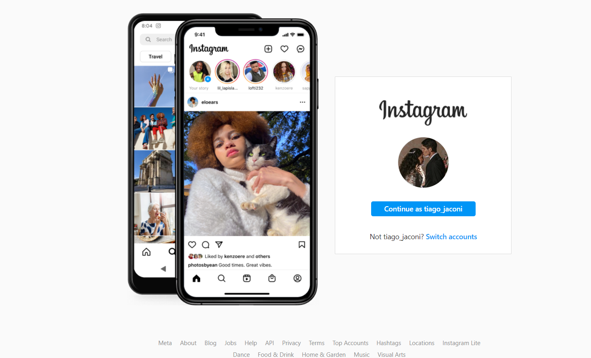
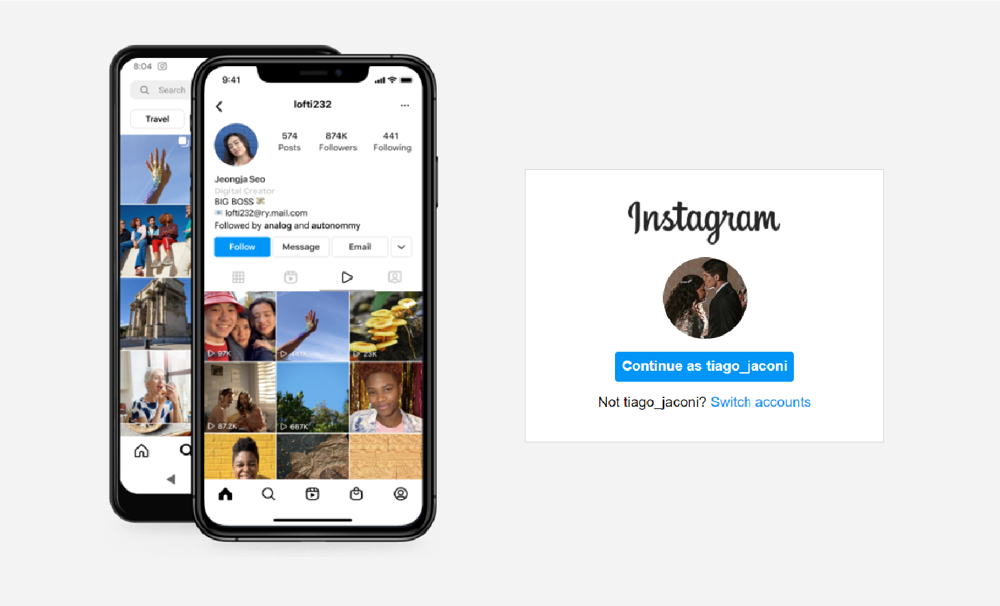

# Descrição do Desafio

 > Nesse projeto você terá o desafio de reconstruir a página de login do Instagram. Para isso, é recomendado o uso de CSS com Flexbox, uma das abordagens de posicionamento de elementos mais utilizadas quando se trata de responsividade.

A foto acima é a visualização atual do site, no projeto não foi implementado o rodapé.

* A responsividade da página foi implementada para alguns tamanhos de tela.
* Foi inserido uma função extra ao conteúdo apresentado no curso, sendo a inclusão da troca de fotos do celular em primeiro plano com JavaScrip.

Na foto acima podemos ver o resultado do projeto final.