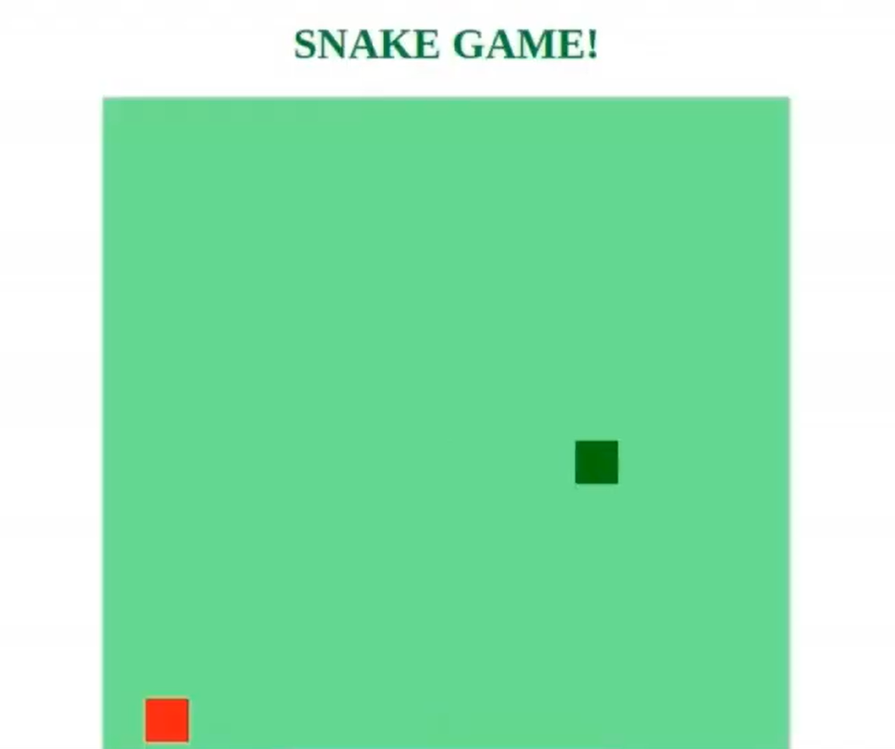
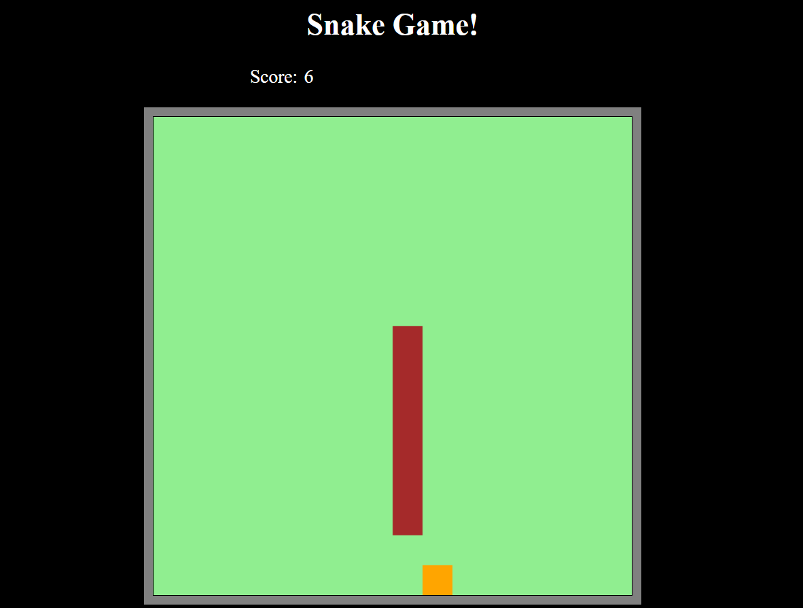

# Descrição do Desafio

 > Já pensou em criar seu próprio jogo do zero? Aprenda a desenvolver de forma simples o clássico jogo da cobrinha utilizando HTML, CSS e JavaScript. Sendo assim, sua missão é reproduzir esse projeto prático, considerando todas as instruções e dicas da expert. Nesse sentido, fique a vontade para implementar suas próprias melhorias e evoluções.

A foto acima é a visualização do projeto implementado no curso.

* Foi inserido funções extras ao conteúdo apresentado no curso, sendo a inclusão da reinicialização automática após o fim do jogo, garantindo que o jogo reinicie corretamente. Inserido a pontuação do usuário e ajustes de layout.

Na foto acima podemos ver o resultado do projeto final.
